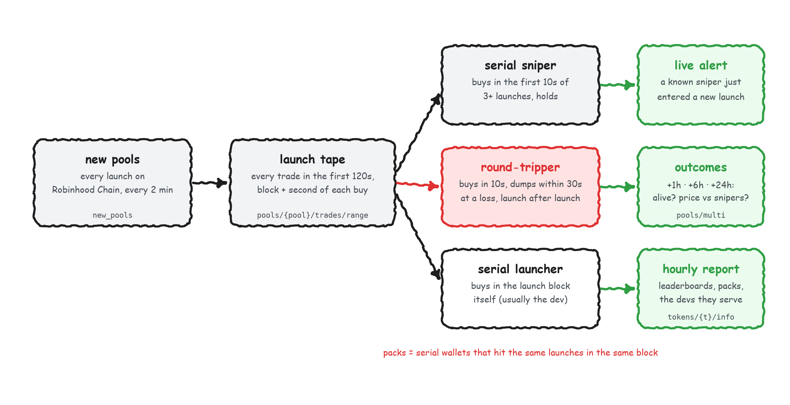

<picture>
  <source media="(prefers-color-scheme: dark)" srcset="core/brand/coingecko-api-on-dark.svg">
  
</picture>

# New Pair Bouncer

A bot that checks every new pair on Robinhood Chain before it buys, and turns most of them away.

Robinhood Chain gets hundreds of new pools an hour. Buying them blind is a losing game: in our
backtest, putting $100 into every new pair a few minutes after launch and holding for up to an hour
lost about a fifth of the money (−21.5% a trade), and live paper trading lost 10.8% a trade. A lot of
what goes wrong is visible in the first two minutes if you look at *who* is trading, not just at the
chart: a thin crowd of a few wallets, early buyers sitting on a big chunk of the supply, a launch
wallet whose last pools had their liquidity pulled, buyers who are the same bots that hit every
launch.

The strongest signal turned out to be the simplest: **the same wallets keep showing up early in launches
that die.** Rugs on this chain come from a recurring ring of launch wallets and the bots that buy into
their launches. Their addresses repeat, so the bot remembers them.

The Bouncer looks. For each new pair it reads the launch, profiles the wallets behind it with
CoinGecko API data, and returns **ENTER**, **WATCH** or **AVOID** with the reason. Three paper books
then trade the verdicts so you can see what the checks are worth.



## What it checks

Cheapest first. A pair that fails a free check never costs an API call.

| check | fails when | data |
|---|---|---|
| **rug ring** | a wallet that bought in the first 30 seconds was early in 2+ earlier launches, and 30%+ of those were dead within the hour | the bot's memory of past launches + pool trades |
| **dev sold** | the token's developer (or the creation-block buyer) already sold in the launch window | pool trades with wallets |
| **supply grab** | the wallets that bought in the launch window still hold 25%+ of the supply (warns at 15%+ for the top 3) | pool trades + token supply |
| **deployer rug history** | this deployer's earlier pools had their liquidity gone within an hour | the bot's memory of past launches |
| **crowd** | fewer than 15 unique buyers, or the 3 biggest buyers did more than 45% of the buying | pool trades |
| **known bots** | more than 15% of buyers are wallets the bot already knows as round-trip or dust bots | memory |
| **entity cluster** | half the buyers belong to one coordinated group: a known cluster of wallets that keep buying the same launches within a few blocks, or a fresh same-block cohort | memory + pool trades |
| **wash trading** | 90%+ of the volume comes from wallets that bought and sold within 30 seconds | pool trades |
| **token info** | honeypot flag, developer holding over 20% (GT Score and holder concentration warn) | CoinGecko token info |
| **wallet profiles** | most of the biggest buyers are fresh wallets that have traded 3 tokens or fewer, ever | CoinGecko wallet PnL |
| **liquidity** | under $3,000 in the pool | CoinGecko pools |

A pair is **AVOID** if any check fails, **WATCH** with two or more warnings, **ENTER** otherwise.
Every threshold lives in `sniper.yaml` (see Settings).

The bot's memory comes from the launches it has already seen: which wallets keep sniping, which ones
buy and dump within seconds at a loss (they fill buyer lists, they don't trade), which wallets move
together, and which deployers pulled liquidity before.

## What the backtest says

`python -m sniper backtest-bouncer` replays every recorded launch the way the live bot would have
seen it. The memory only uses launches created before each one (and outcomes already known at the
time), the entry is the price at decision time, and exits are simulated on minute candles with the
same take-profit (+100%), stop-loss (−50%) and one-hour limit as the live books. Selling goes through
the pool's remaining liquidity: a pool whose liquidity was pulled pays back ~nothing, whatever its last
price says. (An earlier version of this backtest valued pulled pools at their last price, which made
several "winning" strategies look great. They weren't.)

Backtest snapshot: 3,644 launches on Robinhood Chain over 49 hours (Sept 29 and Oct 1 2026), 2,845
with a simulated trade, free checks only, $100 per pair:

| book | buys | trades | paper return | lost 90%+ |
|---|---|---:|---:|---:|
| buy everything | every new pair | 2,845 | −35.9% | 763 |
| crowd only | 15+ buyers, top 3 under 45% | 1,023 | −42.9% | 382 |
| skip the rug ring | every pair the rug ring check passes | 1,886 | −18.4% | 91 |
| bouncer | ENTER only | 92 | −15.4% | 11 |

**What the rug ring catches.** Many rugs here are dead within two minutes, before any bot that waits
for data can act, so the fair test is the pools still trading when the bot decides (1,767 of them).
293 of those were dead within the hour; the rug ring had flagged 255 (87%). Of the 1,474 that
survived, it flagged 211 (14%). A flagged pair died within the hour 55% of the time, an unflagged one
3%. In paper terms: buying all 1,767 lost 24.7% a trade, the flagged ones lost 48.3% (half of them
lost 90%+), the unflagged ones 16.2%.

**What it doesn't do: make money.** Every book loses. Skipping the ring halves the damage; nothing
here found an entry that wins after price impact and fees. Read it as a filter that keeps you out of
the worst launches, not as a strategy. Re-run the backtest on your own data before you trust any
number here.

## How fast it is

Not sniping fast, and it doesn't try to be. On Robinhood Chain, CoinGecko's onchain data lands about
1 to 3 minutes after the block (measured Oct 1 2026: WebSocket trade messages a median 161s behind
the chain; REST the same within a few seconds). The bot records two minutes of trading, waits for
it to be indexed, and decides about six to seven minutes after launch. The API work for a full check (trades
with wallets, token info, a handful of wallet profiles) takes about two seconds.

Other chains are faster on the same API: in a short test, Solana trades arrived about 5 seconds behind
the chain and Base about 30 seconds. Set `chains` and re-run the backtest before trading there.

## Quickstart

```sh
uv venv --python 3.12 .venv
uv pip install -e ".[dev]"
cp env.example .env          # add COINGECKO_API_KEY off-screen; keep COINGECKO_ENVIRONMENT=pro

# check every new pair for 30 minutes and paper-trade the verdicts
.venv/Scripts/python -m sniper collect --minutes 30      # macOS/Linux: .venv/bin/python
.venv/Scripts/python -m sniper web                       # dashboard on http://localhost:8765
```

Run it unattended so the paper books build a track record:

```powershell
# Windows: a hidden supervisor that restarts the collector if it ever exits
powershell -ExecutionPolicy Bypass -File scripts/start.ps1
powershell -ExecutionPolicy Bypass -File scripts/stop.ps1

# start it again automatically every time you log in (no admin rights needed)
powershell -ExecutionPolicy Bypass -File scripts/install-autostart.ps1
powershell -ExecutionPolicy Bypass -File scripts/uninstall-autostart.ps1
```

The bot only runs while the machine is awake: if it sleeps, collection pauses and picks up again
when it wakes.

```sh
# macOS/Linux
make sniper-autopilot     # nohup, logs to data/collect.log
```

Everything lands in `data/sniper.db` (SQLite). Stopping and restarting resumes where it left off.
The launch analysis needs `trades/range`, cursor pagination and the wallet endpoints, so plan on the
Analyst plan or above. Start at
[coingecko.com/en/api](https://www.coingecko.com/en/api?utm_source=github&utm_content=the_smart_ape).

## The dashboard

`python -m sniper web` serves a read-only page next to the running bot. It never calls the API and
never sees your key. It shows each verdict as it lands with the reason, the three paper books side by
side, the latest backtest, and cluster alerts: the pairs turned away because one coordinated group was
doing the buying.

## Commands

| command | what it does | credits |
|---|---|---|
| `python -m sniper collect [--minutes N]` | find new pairs, record launch tapes, run the checks, paper-trade the verdicts, snapshot outcomes; hourly: refresh the memory, fetch launch info, rewrite the report | ~20-30K a day on Robinhood Chain, capped by `max_credits_per_day` |
| `python -m sniper web [--port 8765]` | live dashboard, read-only | 0 |
| `python -m sniper backtest-bouncer [--out rows.json]` | walk-forward replay of the checks over every recorded launch | 1 per launch, once (minute candles, cached) |
| `python -m sniper report` | markdown report: serial snipers, bots, clusters, outcomes | 0 |
| `python -m sniper leaderboard` | the wallets in the bot's memory, by class, and their clusters | 0 |
| `python -m sniper money` | what repeat snipers put in and took out of the tokens they sniped (CoinGecko wallet PnL) | ~8 per wallet |
| `python -m sniper profile` / `enrich` | wallet histories / token info for launches that drew repeat wallets | ~4 per wallet / 1 per launch |

## Settings

`sniper.yaml` at the repo root. Every key is optional; defaults are in `sniper/config.py` and
`sniper/checks.py`.

```yaml
chains: [robinhood]          # any GeckoTerminal network id: base, eth, bsc, solana, arc, ...
handle: your_x_handle        # utm_content on the CoinGecko links in the report
max_credits_per_day: 60000   # counted in the database per UTC day; the bot pauses past it
bouncer_enabled: true
bouncer:
  min_buyers: 15
  max_top3_buy_share: 0.45
  max_early_supply_share: 0.25
  max_bot_buyer_share: 0.15
  max_cluster_buyer_share: 0.5
  position_usd: 100
  take_profit_pct: 100
  stop_loss_pct: 50
  max_hold_min: 60
```

## CoinGecko data vs. what this repo computes

CoinGecko API supplies the data: new pools, every trade with its block, timestamp, sender and size,
token supply, token info (developer address, developer holding, honeypot flag, GT Score), pool prices
and liquidity, minute candles, and wallet PnL and trade history.

Everything else is computed here from that data: the checks, the verdicts, the memory (repeat
snipers, round-trip and dust bots, wallet clusters, deployer history), the paper trades and every
return figure. These are editable inferences, not CoinGecko API fields, official classifications or
judgments about anyone behind a wallet.

## Data notes

- **What counts as a launch.** A token's first pool. Extra pools of a token that already had one
  (fee tiers, post-graduation pools) are skipped. Pools whose trading opens minutes after creation
  are re-anchored on their first trade.
- **Same-transaction legs.** Hook pools (e.g. Bankr) report a small opposite-side swap next to every
  trade, and some launchpad router calls show the sender both buying and selling. When one sender has a
  buy and a sell in the same transaction, only the larger side is kept.
- **Trades are attributed to the transaction sender.** ERC-4337 bundlers (addresses starting with
  `0x4337`) submit other users' trades and are set aside.
- **What the checks can and can't see.** The worst launches were caught by the rug ring, by a thin
  crowd, by launch wallets whose earlier pools died, and by supply held by the first buyers. A dev who already sold
  was not a useful predictor on its own: those pairs blew up less often. Wash trading and
  wallet clusters were not good rug predictors on their own: they mark launches whose volume isn't
  real demand and that go quiet within the hour, which still matters if you need to sell.
- **Young tokens have thin safety data.** Minutes after launch, GT Score is usually low, honeypot
  status is often "unknown" and holder counts are often empty. That gap is why the checks lean on
  trades and wallets.
- **Paper only.** Nothing here places trades. Fills use pool liquidity for price impact plus a fee,
  and returns are simulated. This is research, not trading advice.

## Make it yours

Ask Claude Code or Codex:

- "Read AGENTS.md, then add a check that fails a pair when its top buyer is a wallet whose last 5 tokens all lost 90% within a day, with an offline test."
- "Run the bouncer on Solana as well and add a per-chain table to the backtest output."
- "Send ENTER verdicts to a Telegram bot with the checks it passed."
- "Make the exits trail: sell half at +50%, move the stop to break-even."

## Also in this repo

This project is a fork of CoinGecko's
[onchain-signal-bot](https://github.com/cg-brianlsh/onchain-signal-bot) starter, and the original
paper-trading bot still ships here (`bot/`, `strategies/`). The only change to the shared `core/` is
in `core/client.py`: it retries 5xx responses and bounds its in-memory response cache for long runs.
See [docs/onchain-signal-bot.md](docs/onchain-signal-bot.md).

## Links

<!-- coingecko-links:start -->
- CoinGecko API: https://www.coingecko.com/en/api?utm_source=github&utm_content=the_smart_ape
- Pricing: https://www.coingecko.com/en/api/pricing?utm_source=github&utm_content=the_smart_ape
- Docs: https://docs.coingecko.com?utm_source=github&utm_content=the_smart_ape
- Agent Skill + MCP: https://docs.coingecko.com/ai-integration?utm_source=github&utm_content=the_smart_ape
<!-- coingecko-links:end -->

Data comes from the CoinGecko API. This is a research tool: it places no trades, and nothing in it
is trading advice.
