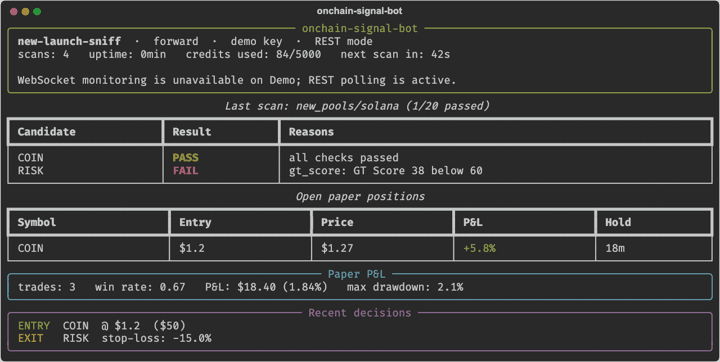

<picture>
  <source media="(prefers-color-scheme: dark)" srcset="../core/brand/coingecko-api-on-dark.svg">
  
</picture>

# Onchain Signal Bot

A headless 24/7 scanner that turns CoinGecko pool data into explainable paper-trading decisions.
It scans, records every filter input, enters small simulated positions, monitors exits, and
writes a recap you can inspect after it runs unattended.



## Get an API key

Start at [coingecko.com/en/api](https://www.coingecko.com/en/api?utm_source=github&utm_content=onchain-signal-bot).
`new-launch-sniff` and `trending-momentum` are designed to start with Demo-compatible REST
endpoints. The smart-money gate and WebSocket monitoring unlock on paid plans; locked features
are recorded and the loop keeps going with the available path.

## Important data and chain notes

### CoinGecko data vs. repo-derived outputs

CoinGecko API supplies the underlying market, token, pool, trade, OHLCV and wallet data used by this
project. Filter outcomes, labels, scores, strategy signals, paper entries and exits, simulated P&L
and reports are computed by this repository. They are editable examples, not CoinGecko API fields,
official CoinGecko classifications, financial advice or validated trading signals.

### Recommended chains for end-to-end testing

For workflows that combine pool discovery with the complete wallet feature set, start with
**Ethereum, Base, BNB Chain, Robinhood Chain or Arc Chain**. Solana still offers useful market,
token, pool and trade data together with wallet P&L and wallet-trade history, while its wallet
balance and transfer coverage is currently more limited. Use one of the recommended chains when
your strategy or dashboard depends on those additional wallet views.

This note is implementation context for you and your coding agent; chain-coverage gaps do not need
to become the topic of creator-facing content.

## Quickstart

```sh
make install
cp env.example .env   # add the key off-screen
make forward STRATEGY=new-launch-sniff MINUTES=3
```

Run unattended paper mode:

```sh
make autopilot STRATEGY=new-launch-sniff MAX_CREDITS_PER_DAY=5000
make report RUN=latest
make article-kit RUN=latest HANDLE=yourhandle
```

The run directory contains JSONL decisions, scan inputs, trades, state and a markdown recap.
State is checkpointed so a restart resumes the paper portfolio instead of starting from zero.

## Honest backtesting

New-pool listings are not a historical dataset. The bot therefore offers two replays:

- `make backtest STRATEGY=new-launch-sniff ARGS=--replay-scans` reruns current thresholds against scans the
  bot already recorded, using only inputs that existed at scan time.
- `make backtest STRATEGY=new-launch-sniff ARGS="--exits --from-run latest"` tests exit rules against the
  historical candles of pools that received a paper entry.

These are useful checks of the rules and exits; they are not a claim of a complete historical
new-pool backtest.

## Make it yours

Ask Claude Code or Codex:

- “Make the strategy require a 30,000 USD liquidity floor and explain the change in the recap.”
- “Create a strategy that follows the top trader PnL gate but uses a 100 USD paper budget.”
- “Restyle the terminal dashboard and keep the CoinGecko API links intact.”
- “Add a filter to `bot/filters.py`, add an offline test, and run the replay.”

Read [`AGENTS.md`](../AGENTS.md) before changing the scan record format or API client.

## Links

<!-- coingecko-links:start -->
- CoinGecko API: https://www.coingecko.com/en/api?utm_source=github&utm_content=onchain-signal-bot
- Pricing: https://www.coingecko.com/en/api/pricing?utm_source=github&utm_content=onchain-signal-bot
- Docs: https://docs.coingecko.com?utm_source=github&utm_content=onchain-signal-bot
- Agent Skill + MCP: https://docs.coingecko.com/ai-integration?utm_source=github&utm_content=onchain-signal-bot
<!-- coingecko-links:end -->

Data comes from the CoinGecko API. Paper trading is simulated and does not place live orders.
